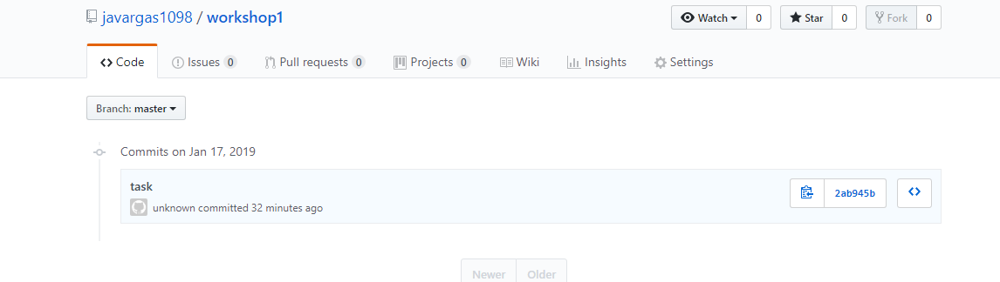

# LAB1 ARSW

### What is the purpose of this command?(git add .)
	This command create a new file in a root directory, add new files , and update the repository
### Why we used it? (git commit -m "Message")
This command server to Commit files to the local repository
### What is the purpose of the this command?(git push origin master)
	This command server to send changes to the remote repository
### What is the purpose of this command?(git clone <repository>)
	this command server to download the remote repository
	
### screenshoot
	
	
### What that command does?(git pull origin master)
	 this command server to merge changes to the local repository
	 
